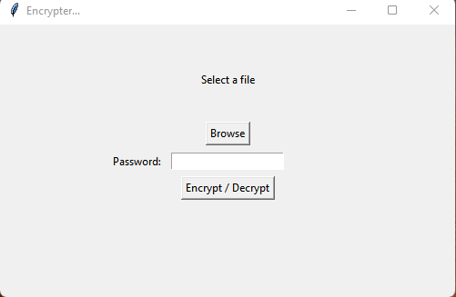
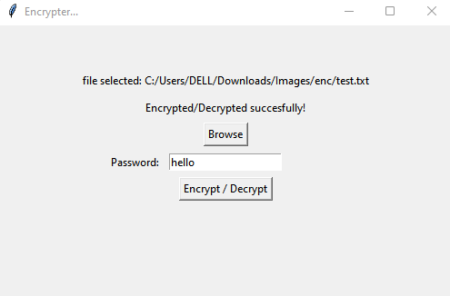
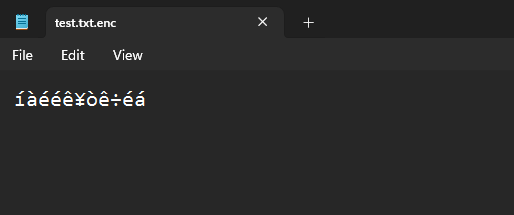

# FileEncrypt
This is a program written in python to Encrypt any type of file

_________________________________________________________________
This is the text before Encryption 
 
Encrypted... 
 
This is the encrypted text... 
 
